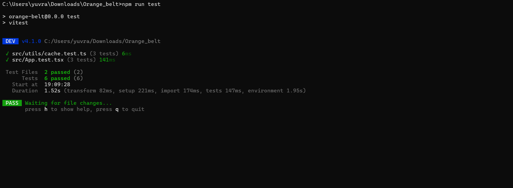

# ETH Portfolio Dashboard 🚀

A feature-rich decentralized portfolio tracker built on Ethereum. Go far beyond checking a single balance — track multiple addresses, view live USD values, resolve ENS names, and switch networks.

## Features ✨

## Live Demo & Links 🔗
- **Live Demo Link:** *https://orangebelt1-git-main-yuvraj-vibhutes-projects.vercel.app/*
- **Demo Video Link:** [View Screen Recording](Video.mp4)

- **Test Output Screenshot:** 

## Features ✨

| Feature | Description |
|---|---|
| 🔍 **Balance Search** | Look up any address or ENS name (e.g. `vitalik.eth`) |
| 💵 **Live USD Price** | Real-time ETH/MATIC price via CoinGecko (cached 2 min) |
| 📋 **Watchlist** | Save unlimited addresses with labels, persisted in localStorage |
| 💸 **Fund Transfer** | Send XLM on Stellar directly via Freighter wallet |
| 📊 **Portfolio Total** | Aggregates USD value across all watched addresses |
| 🌐 **Multi-Network** | Ethereum Mainnet, Polygon, Sepolia Testnet, Stellar |
| ⚡ **Batch Contract Call** | Uses `BalanceChecker.getBalances()` for efficient multi-address fetch |
| 🧠 **Intelligent Cache** | 5-min TTL balance cache reduces redundant RPC calls |

## Project Structure 📁

```
Orange_belt/
├── contracts/
│   └── BalanceChecker.sol              # Solidity contract — single + batch balance queries
├── src/
│   ├── integration/
│   │   └── contractIntegration.ts      # Contract ↔ Frontend bridge (ENS, networks, ABI)
│   ├── components/
│   │   ├── LoadingIndicator.tsx        # Animated loading spinner
│   │   ├── NetworkSelector.tsx         # Network dropdown (Mainnet / Polygon / Sepolia)
│   │   ├── AddressCard.tsx             # Single watchlist entry (balance, USD, copy, remove)
│   │   ├── FundTransfer.tsx            # Stellar XLM payment UI via Freighter
│   │   └── WatchlistPanel.tsx          # Portfolio view with summary bar + cards grid
│   ├── utils/
│   │   ├── cache.ts                    # 5-minute TTL localStorage balance cache
│   │   ├── cache.test.ts               # Cache tests
│   │   └── priceCache.ts              # CoinGecko price fetcher (2-min in-memory cache)
│   ├── App.tsx                         # Three-tab dashboard (Search, Watchlist, Transfer)
│   └── App.test.tsx                    # 6 test suites
├── package.json
└── vite.config.ts
```

## Smart Contract 📄

`contracts/BalanceChecker.sol` — Solidity ^0.8.20, view-only (zero gas cost for users):

| Function | Description |
|---|---|
| `getBalance(address)` | Single address ETH balance |
| `getBalances(address[])` | **Batch** — returns balances for many addresses in one call |
| `getMyBalance()` | Returns the caller's own balance |

## Integration Layer 🔗

`src/integration/contractIntegration.ts` bridges the contract and React frontend:

- `fetchBalanceViaContract(addressOrENS, provider)` — Resolves ENS names, fetches balance via contract (or direct RPC fallback)
- `fetchBatchBalances(addresses, provider)` — Batch fetch using `getBalances()`
- `resolveENS(name, provider)` — Wraps `provider.resolveName()` with error handling
- `getProviderForNetwork(network)` — Returns the correct RPC provider for any supported network
- `NETWORKS` constant — typed config for Mainnet, Polygon, Sepolia

## Getting Started 🛠️

### Prerequisites
- Node.js v18+

### Installation

```bash
git clone <repo-url>
cd Orange_belt
npm install
npm run dev
```

### Running Tests 🧪

```bash
npm run test
```

9 tests across 3 suites — all passing ✅

### Deploying the Contract (Optional)

1. Deploy `contracts/BalanceChecker.sol` on any EVM network.
2. Set the deployed address in `src/integration/contractIntegration.ts`:
   ```ts
   export const BALANCE_CHECKER_ADDRESS = '0xYourDeployedAddress';
   ```
The app will use the contract for all balance queries automatically.

## Tech Stack

| Layer | Technology |
|---|---|
| Frontend | React 19 + TypeScript, Vite |
| Smart Contract | Solidity ^0.8.20 |
| Blockchain | ethers.js v6 |
| Price Data | CoinGecko Public API |
| Testing | Vitest, @testing-library/react |
| Styling | Vanilla CSS — custom dark design system |
